# WinCV Remake

**繁體中文** ｜ [English](README_en.md) ｜ [日本語](README_jp.md)

WinCV（CView for Windows）是台灣的共享軟體，作者 Lcc Wizard（林健總）一個人從 1999 年
維護到 2011 年，站台 cview.com.tw，最後一版 0.52 更新於 2011 年 11 月 24 日。
它的執行檔裡沒有應用邏輯，真正的程式是隨附的一份 Forth image。這個 repo 把那份 image
逆向出來，用 Go 重寫成不綁在 Windows 上的程式。標準不是「功能差不多就好」。
原版畫面上哪一格擺什麼字、那一格是什麼顏色，都是對著原版量過再寫的，
8×16 的格子一格不動。

## 完成了什麼

2004 年 8 月，有人在部落格上寫 CView 是「以前 DOS 時代最喜歡的一套軟體」，
看圖「超快」，文章的最後一句是：「真希望他能開發 Linux 版~~」。

原版停在 2011 年 11 月 24 日。它是 32 位元 Windows 執行檔，解壓縮與看圖靠一批
Windows DLL——`unrar.dll`、`unlha32.dll`、`CAB32.DLL`、`FreeImage.dll`。
那些依賴綁死在一個平台上，沒有人保證它們在下一版 Windows 上還載得起來。

留著執行檔不等於留著這支軟體。要保住的是行為：排序規則、欄位怎麼對齊、
編碼怎麼判讀、按哪個鍵會發生什麼事。這些只有重新實作一次才會留下來。

所以逆向的對象不是 52 KB 的 `wincv.exe`（那只是 Forth kernel，沒有應用邏輯），
而是 1.52 MB 的 `WINCV.IMG`：3663 個 word、9497 筆符號、29 個具名顏色的 RGB
一個一個從 word body 裡取出來。檔案清單每一欄的顏色是把兩邊的截圖切成同一套
格點、逐格量出來的——指示欄是一整條深藍而且游標經過也不變、日期固定綠色、
長檔名欄帶底線。照終端機慣例猜，沒有一項會猜對。

12 種壓縮格式全部支援，其中 LZH、`.Z`、CAB、ARJ、ARC、ACE 六種是自寫的，
每一種都對照參考實作逐檔驗過 sha256——p7zip 675 個成員、ncompress、cabextract、
arj 3.10、arc 5.21、acefile 269 個成員。沒有 oracle 可比對的格式就不寫解碼器：
一個沒驗過的解碼器會安靜地解出看起來有內容、實際上是錯的檔案。

原版讀不到的東西也接上了：gopher 站台、網頁、EPUB 電子書、Word、PowerPoint、
Excel 與 PDF，走的是同一個畫面與同一組按鍵。做法是把它們一律壓成「一段一段的
文字、一個一個的連結、幾張圖」——那正好是這個字元格點畫得出來的東西，
也正好是 1999 年那套介面本來就在做的事。PDF 多一種看法：`V` 把整頁真的畫出來，
路徑、填色、漸層、透明度與嵌入字型的字形外框都自己解，對照 poppler 的算繪
逐格量過。

現在它跑在 Linux、Windows、macOS 和 Android 上。2004 年那句「真希望他能開發
Linux 版」，隔了二十二年有了回應。

說這是台灣軟體的文藝復興，太重了——這只是一支軟體。但它當年是很多人每天在用的
東西，而它本來會消失在一個沒人裝得起 32 位元 Windows 的年代。現在不會了。

> Remake by 王俊又 —— 為保存台灣中文軟體盡一份心力

---

把 1999–2011 年的台灣共享軟體 **WinCV 0.52（CView for Windows）** 逆向，
用 Go + Ebiten 重寫成 Linux / Windows / macOS / Android 都能跑的版本，
介面與原版點陣像素對齊。原作者是 Lcc Wizard（林健總），原站 `cview.com.tw`。

WinCV 是一支在同一個畫面裡做完很多事的中文工具：瀏覽目錄、看文字檔、看圖與縮圖、
把壓縮檔當目錄走進去、編輯文字、看 HEX、在 Big5 / GB / SJIS / KOR / Unicode 之間轉碼、
查英漢字典與 KK 音標、算 MD5 與 SFV。它的最後一次更新停在 2011 年 11 月 24 日
（`whatsnew.txt` 的最後一筆），之後沒有 Linux 版，也沒有 macOS 版。

下載：[v0.52-remake.2](https://github.com/wicanr2/wincv-remake/releases/tag/v0.52-remake.2)
（Linux / Windows / macOS / Android，解開就能跑，字型已經在裡面）

remake 的原始碼、工具與文件走 [BSD 2-Clause](LICENSE)。**原版 WinCV 的著作權屬於
原作者 Lcc Wizard（林健總）**，授權不涵蓋它——重寫是為了保存這份文化資產，
不是取得原版的權利。repo 裡保留原版安裝檔與由它抽出的資料（符號表、UI 字串、參考截圖），
是為了讓逆向結論可以被重跑驗證。發布的執行檔**內嵌**原版隨附的半形點陣字型與
倚天的全形字庫，好讓解開就有與原版逐像素對齊的畫面；它們的權利仍在原權利人手上，
BSD 2-Clause 不涵蓋。字典資料不打包。逐項的著作權與出處在 [NOTICE](NOTICE)，
權利人若希望調整任何處置，請開一個 issue。

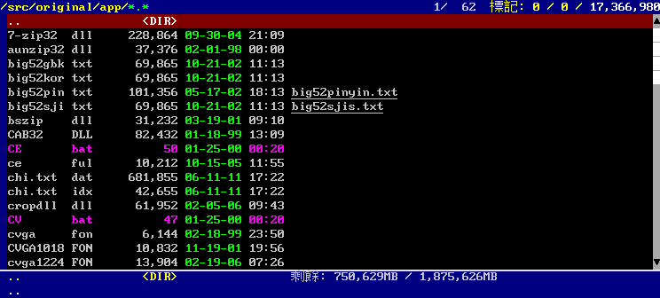

*重製版瀏覽原版自己的安裝目錄。欄位、對齊、配色與原版同格點。*

---

## CView 是什麼

CView 是 DOS 時代的檔案瀏覽器，用 F-PC Forth 寫成；進到 Windows 之後，
作者改用 Win32Forth v4 的 subroutine-threaded code 重寫，成為 WinCV。
兩個版本的手感是同一套：滿版的字元格點畫面，游標在檔案列表上跑，
按一下就把文字檔攤開，再按一下就進到壓縮檔裡面，不必先解到某個暫存目錄。

當年用過的人記得的多半是速度。2004 年 Tsung 在自己的部落格寫，
CView 是「以前 DOS 時代最喜歡的一套軟體」，看圖「超快」，
文章結尾那句是：「真希望他能開發 Linux 版~~」
（[Tsung's Blog, 2004-08](https://blog.longwin.com.tw/2004/08/cview/)）。

也有人花了好幾年找替代品。大丙從 2006 年找到 2009 年，
先後試過 WinCV 0.5、FreeCommander、Universal Viewer 5.1.0 和 Directory Opus 9.5，
多數敗在中文換行或編碼上；他要的是「一套像 DOS 時代的 CVIEW 一樣，
能快速看文字檔的軟體」，中間還抱怨了一句「可惜的是 ACDSee 沒法看文字啊」，
最後的結論是只有 Directory Opus 勉強堪用
（[大丙的筆記](https://blog.dabinn.net/cview替代軟體/)）。

作者這一側的紀錄也還在。2012 年 1 月，有人在他的部落格留言板留下
「你的 wincv 真的很棒…每天都在用」，作者回覆時提到自己時間有限、更新很慢
（[lcc-wizard.blogspot.com](http://lcc-wizard.blogspot.com/2012/01/blog-post.html)）。
軟體王的 [WinCV 0.52 下載頁](https://www.softking.com.tw/7555/) 到今天還在線上，
列在繁體中文的檔案管理工具底下，檔案大小 5.56 MB。

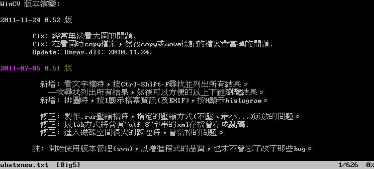

*重製版顯示原版自己的 `whatsnew.txt`：Big5 編碼判讀、語法上色、Big5 全形字。
第一列的橫條是游標（光棒），`↑↓` 移動它。*

## 為什麼重寫

原版是 32 位元 Windows 執行檔，解壓縮和看圖都靠一批 Windows DLL：
`unrar.dll`、`unlha32.dll`、`unarj32j.dll`、`unacev2.dll`、`CAB32.DLL`、`7-zip32.dll`，
以及 `FreeImage.dll` 和 Intel 的 `ijl15.dll`。這些依賴綁死在一個平台上，
而且沒有人能保證它們在下一版 Windows 上還能載入。

要保住的是行為——排序規則、欄位怎麼對齊、編碼怎麼判讀、按哪個鍵會發生什麼事——
這些東西只有重新實作一次才會留下來。所以逆向的對象不是 `wincv.exe`
（那只有 52 KB，是 Forth kernel，沒有應用邏輯），而是 1.52 MB 的 `WINCV.IMG`，
程式本體在裡面。

2004 年那句「真希望他能開發 Linux 版」沒有等到原作者的回應。這個 repo 是自己動手的版本。

## 與原版的差異

| 項目 | 原版 WinCV 0.52 | 本重製版 | 說明 |
|---|---|---|---|
| 平台 | 32 位元 Windows | Linux / Windows / macOS / Android | 同一份 `internal/` 編四個平台 |
| 解壓縮 | 外掛 Windows DLL | 純 Go：標準庫、第三方套件，加上六個自寫解碼器 | 12 種格式全部支援 |
| 圖檔解碼 | `FreeImage.dll` + Intel `ijl15.dll` | 純 Go 解碼 | 12 種格式支援 11 種，缺 Photo CD |
| 半形字型 | 自帶點陣字型 `cvga.fon`，8×15 | 直接解析原版的 `.FON` 取字模 | 字模真值來自字型檔本身 |
| 全形中文字形 | 交給 Windows GDI 用系統字型畫（image 內指名「新細明體」） | 倚天（ETEN）點陣字庫 `STDFONT.15`，16×15 | 原版的中文長相隨每個人的 Windows 而異，重製版需要一個確定的來源 |
| 格子大小 | 8 × 16 | 8 × 16 | 字模 8×15 靠上對齊，下方留一列。原版列高取自它同時要求的 16 px 全形字 |
| 選單與工具列 | Win32 選單列 + 圖示工具列 | 自繪的選單列（`F9`），分成檔案／檢視／工具／設定／說明 | 全畫面都是自己畫的格點，不用原生控制項。原生選單掛在 client area 之外不佔字元格，自繪的一定會吃掉一列 |
| 說明 | 說明檔 | `F1` 內嵌的使用說明 | 內嵌而不是讀檔——說明必須在沒有安裝目錄、從壓縮檔跑、Android 上沒有可讀程式目錄時都叫得出來 |
| 預視窗格 | 有 | `Alt-P`，底部 8 列 | 文字顯示前幾行、二進位排 16 進位、圖檔顯示格式與尺寸 |
| 狀態列 | 兩列：檔案欄位 + 完整檔名 | 同樣兩列，逐格對過 | 第二列與原版**逐像素相同** |
| 左側磁碟欄 | Win32 工具列旁的窗格，列出磁碟機代號 | 清單左邊的格子窗格，`Alt-D` 開關 | Linux / macOS 沒有磁碟機代號，改列掛載點；可卸除的另外上色 |
| 捲軸 | Win32 控制項 | 最右邊一欄，箭頭 + 滑塊 | 原版那根用系統顏色畫，做不到像素等價 |
| 半形字碼表 | CP437 | 同樣走 CP437 | ANSI art 用的 `░▒▓█│─` 都在 0xB0–0xDF，當成 Latin-1 會整批畫成別的字 |
| 副檔名配色 | 有（`.bat` 整列洋紅） | 尚未實作 | 原版可在設定裡改 |
| KK 音標 | 自訂編碼，一個位元組一個音素 | 轉成 IPA 顯示（`ˈlɪtl̩`、`ˈbʌtn̩`） | 對照表解在 `internal/dict/kk.go` |
| 字級 | 設定裡選三種點陣字型之一 | `Ctrl-+` / `Ctrl--` 即時切換同樣三種 | 24 點的全形漢字倚天光碟上是壓縮的，那一級的中文由 16×15 縮放 |
| 視窗 | 固定版面 | 放大視窗就多幾格 | 格子大小不變，多出來的空間變成更多欄列 |
| Big5 以外的字 | 交給 Windows 系統字型 | 掃系統字型目錄組一條後備鏈 | 簡體、日文、韓文、西里爾、希臘、阿拉伯、泰文、數學與製表符號、emoji 都補得到。真的缺字畫成空框，不留白 |
| 滑鼠 | Win32 程式，本來就能點 | 點清單移游標、雙擊開啟、點選單列展開、滾輪捲動 | 見下面的「操作」 |
| 關掉再開 | 從頭開始 | 回到上次的目錄、游標位置與開著的文件，**每個檔案還各記一筆看到哪** | 換目錄或開關檔案的當下就寫一次——只在關閉時寫的話，被 kill 或當掉等於沒寫 |
| 散布方式 | 共享軟體，作者對外發行 | BSD 2-Clause（自己寫的部分） | 產物內嵌原版的半形 `.FON` 與倚天的全形字庫，解開就是對齊原版的畫面；那些字型的權利仍在原權利人手上，見 `NOTICE`。字典資料不打包 |

倚天那一列決定了字怎麼排：`STDFONT.15` 的全形格正好是 16×15，
剛好等於 `cvga` 半形 8×15 的兩倍寬、同高，中文與英數落在同一套格點上，不必縮放或補白。

畫面配色沿用原版：29 個具名顏色的名稱與 RGB 值都是從 `WINCV.IMG` 裡解出來的，
不是重新配的一套色。檔案清單每一欄用哪個顏色則是把兩邊的截圖切成同一套格點、
逐格比對量出來的——指示欄是一整條深藍而且游標不覆蓋它、日期固定綠色、
時間跟著檔案自己的顏色走、長檔名欄帶底線，這些照慣例猜都會猜錯。
量測結果與重跑指令記在 `docs/ui/main-screen.md`。


*`F1` 選單同時是說明書：每一列右邊標著對應的按鍵，在選單裡直接按那顆鍵等同選它。*

## 壓縮格式

六個自寫的解碼器都對照參考實作逐檔驗過 sha256，不是拿自己的輸出當期望值：

| 格式 | 實作 | 驗證對象 |
|---|---|---|
| ZIP / TAR / GZ / BZ2 | Go 標準庫 | — |
| RAR / 7z | `nwaples/rardecode`、`bodgit/sevenzip` | 該套件 |
| LHA / LZH | 自寫 | p7zip，675 個成員 |
| `.Z` | 自寫 | ncompress |
| CAB（MSZIP） | 自寫 | gcab / cabextract |
| ARJ（方法 0–4） | 自寫 | arj 3.10 |
| ARC / PAK | 自寫 | arc 5.21 |
| ACE | 自寫 | acefile，269 個成員 |

沒有 oracle 可比對的格式就不寫解碼器。一個沒驗過的解碼器會安靜地解出
看起來有內容、實際上是錯的檔案，那比明講不支援更麻煩。

ACE 沒有內建在原版裡——原版載入 WinACE 原廠的 `unace.dll`（1999，v1 API）
或 `unacev2.dll`（2002，v2 API），`WINCV.IMG` 裡只有綁定層。這裡照
Marcel Lemke 1998 年的〈Technical information of the archiver ACE v1.2〉
自己寫，拿 BSD 授權的 [acefile](https://github.com/droe/acefile) 對答案，
測試資料用 [acefile-testdata](https://github.com/droe/acefile-testdata)。
支援 stored、ACE 1.0 的 LZ77、ACE 2.0 的 blocked（含 LZ77 / DELTA / EXE
三種子模式）；SOUND 與 PIC 兩種子模式、加密、跨片壓縮檔還沒做。

## 字型放在哪裡

字型有兩層,來源不同,找的地方也不同。

**原版的點陣字與倚天字庫**(逐像素對齊的那一套)是第三方版權物。
桌面的發行版把它們**內嵌在執行檔裡**,解開就能用;Android 的 APK 不內嵌,
自己編譯的版本也沒有。要自備、或要用自己的一份蓋掉內嵌的那一份時,
把 `cvga.fon`、`CVGA1018.FON`、`cvga1224.FON`、`STDFONT.15`、`SPCFONT.15`
放進下列任一個位置(前面的贏)。語法上色設定 `keyword_*.cfg` 與字典資料
也找同一批位置:

| 位置 | 說明 |
|---|---|
| `$WINCV_HOME` | 環境變數。按兩下啟動、桌面捷徑都沒有地方打旗標,而那正是工作目錄最不可預測的時候 |
| 執行檔所在的目錄 | 最多人會這樣做。底下的 `wincv/`、`original/app/`、`original/eten/` 也會看 |
| 個人設定目錄 | Linux `~/.config/wincv`、macOS `~/Library/Application Support/wincv`、Windows `%AppData%\wincv`;與 `session.json` 同一套慣例 |
| `~/.wincv` | 上一項取不到時的退路 |
| 工作目錄 | 開發時從 repo 根目錄跑,素材就在 `original/` 底下 |

Android 是外部儲存的 `wincv/`,與桌面的「執行檔旁邊的 `wincv/`」同一個名字。
`-half` / `-eten-std` / `-eten-spc` 直接給路徑時永遠贏過以上全部。
一個都找不到時,程式會把找過的目錄逐行印出來 —— 「檔案沒找到」的訊息
不說找過哪裡的話,使用者只能猜,而這裡正是每個平台都不一樣的地方。

**Big5 以外的字**靠系統字型補(簡體、日文、韓文、西里爾、希臘、阿拉伯、
泰文與各種符號)。完整版另外內嵌 Noto 的幾份子集,不必依賴系統。
系統字型的位置照平台找:

| 平台 | 掃描的目錄 |
|---|---|
| Linux | `/usr/share/fonts`、`/usr/local/share/fonts`、`$XDG_DATA_HOME/fonts`(沒設就是 `~/.local/share/fonts`)、`~/.fonts`、`$XDG_DATA_DIRS` 底下的 `fonts/`、`/run/host/fonts`(Flatpak)、`/run/current-system/sw/share/X11/fonts`(NixOS) |
| Windows | `%SystemRoot%\Fonts`(不是寫死 `C:\`——Windows 不一定裝在 C:)、`%LOCALAPPDATA%\Microsoft\Windows\Fonts`(Windows 10 1803 起「只為我安裝」的字型在這裡,系統目錄裡看不到) |
| macOS | `/System/Library/Fonts`、`/System/Library/Fonts/Supplemental`(Catalina 起附帶的字型搬到這裡)、`/Library/Fonts`、`~/Library/Fonts` |
| Android | `/system/fonts`、`/product/fonts`、`/system_ext/fonts`(Android 10 之後系統被拆成好幾個分割區) |

掃到的字型再依檔名挑:一台桌機的字型目錄裡有好幾百個檔,全部載進來要花
數秒、吃掉數十 MB,而其中絕大多數(裝飾字、單一語系的花體)補不到任何一個
缺字。認得的名字涵蓋四個平台各自的內建字型,不是只有 Noto ——
只認 Noto 的話,掃描在 Windows 與 macOS 上一個字型都找不到,
而那正是掃描存在的理由。

## 建置與驗收

```bash
tools/build-all.sh      # 桌面三平台產物到 dist/(Android 是 tools/build-android.sh)
tools/verify-dist.sh    # 靜態驗收:檔案格式、macOS 逐弧簽章、動態庫依賴
tools/go.sh test ./...  # 測試(全部在 docker 裡跑)
```

原版當 oracle：

```bash
tools/setup-wine-oracle.sh                    # 解安裝檔 + 建 Wine prefix
tools/oracle-measure.sh docs/ui/oracle.png    # 量視窗幾何、截圖、印出選中的字型
```

不開視窗檢查重製版的畫面：

```bash
tools/go.sh run ./cmd/celldump -app <目錄> -keys "F1" -o shot.png -cols 93 -rows 30
```

`-keys` 的寫法與 `docs/ui/keymap.md` 的按鍵欄一致（`Ctrl-O`、`Alt-Z`、`F6`、`Down`…）。

## 移植成果

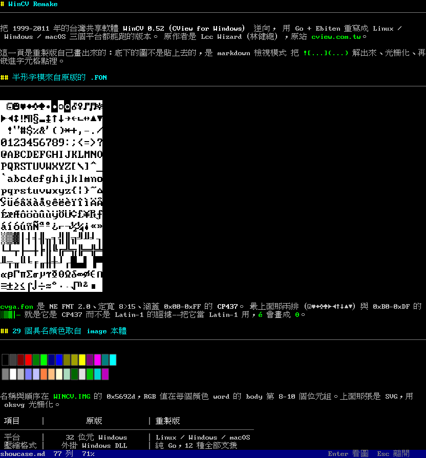

上面這張是重製版**自己畫出來的**——文件是 `docs/demo/showcase.md`，
裡面的字模圖集（PNG）與 29 色色票（SVG）不是貼上去的，
是 markdown 檢視模式把 `` 解出來、光柵化、再嵌進字元格點裡。
重跑：

```bash
tools/go.sh run ./cmd/celldump -app docs/demo -cols 104 -rows 56 \
    -keys "Down,Down,Down,Enter" -o docs/ui/showcase-markdown.png
```

同一份 `render.Rasterizer` 也是 Ebiten 視窗用的那一份，
所以這張 PNG 與視窗裡看到的是同一批像素。

### 檔案瀏覽器（與原版逐格比對過）

| 重製版 | 原版（Wine） |
|---|---|
|  | 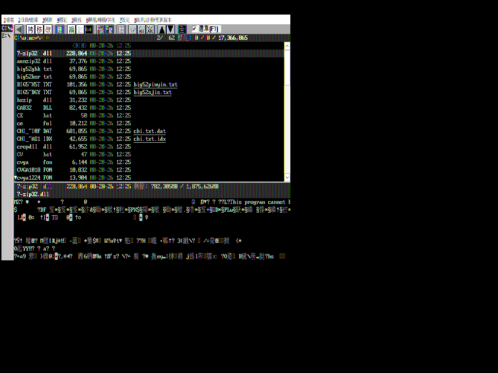 |

檔案清單那 16 列與原版的**屬性差是 0**，狀態列第二列連字模都完全相同。
量測方式與數字記在 [`docs/ui/main-screen.md`](docs/ui/main-screen.md)。

## 重製版多做的東西

原版沒有、但這一版有的：

| 功能 | 說明 |
|---|---|
| markdown 檢視 | 開 `.md` 直接排版：標題、清單、表格、引言、程式碼區塊，**圖片嵌在文件裡顯示**（PNG / GIF / SVG 都可以），`Enter` 把圖放大 |
| SVG | 路徑用 oksvg 光柵化，文字自己畫（oksvg 沒有 `<text>`）。原版是 2011 年的軟體，那時 SVG 還不流行 |
| UTF-8 後備字型 | 倚天沒有的字改用系統 TrueType 補，掃字型目錄而不是只認寫死的路徑 |
| 字級與倍率 | `Ctrl-+`/`Ctrl--` 換點陣字級，`Alt-+`/`Alt--` 放大倍率（每次 0.1）。倍率不是把字模硬拉大：原版隨附的三種點陣字（8×15 / 10×18 / 12×24）之間的比例正好是 1.19 與 1.56，所以 1.2 / 1.5 / 1.6 這幾格會換成**原生的字模**，每個像素都是當年設計出來的 |
| 視窗大小 | `F9` → 設定 → 視窗大小，有原版版面 93×21 等檔位，也可以自訂欄列數 |
| 網路瀏覽 | `F2` 輸入位址。`gopher://` 與 `http(s)://` 走**同一個畫面、同一組按鍵**：`↑↓` 移動連結、`Enter` 開啟、`Backspace` 上一頁。網頁只留文字、連結與圖片，樣式表與腳本一律丟掉 |
| 電子書 | `.epub` 按 `Enter` 先看目錄，點章節進去讀，章末有上下一節。EPUB 就是 ZIP + XHTML，兩塊零件本來就有 |
| PDF | 兩種看法：`Enter` 開第一頁的**文字**（會把字重新組回列、偵測分欄），`V` 把整頁**畫出來**（可放大，見下）。詳見下一節 |
| 文字檢視的光棒 | 讀 `.txt` 時整列反白標出游標在哪一行，`↑↓` 移動游標、走到畫面外才捲動。原版的工具列一直在報游標在第幾行，只是沒有把那一列畫出來。預設開著，`L` 關掉（ANSI 彩色簽名檔的底色本身有意義） |
| Word | `.docx`、`.doc`（Word 97–2003）、`.rtf` 三種都讀：標題、粗體斜體、有序／無序清單、表格、內嵌圖片 |
| PowerPoint | `.pptx` 一張投影片一段，備忘稿一起收；開頭是投影片清單 |
| Excel | `.xlsx` 一張工作表一段，儲存格排成表格 |
| 多國語系 | 介面支援繁體中文、简体中文、English、日本語。啟動時看系統語系,`F9` → 設定 → 語言 可以隨時換,選過就記住。`F1` 使用說明也有各語言一份 |
| 選單字型分離 | 選單那一層有自己的格點，可以用與內容**不同的字型與大小**（`F9` → 設定 → 選單字級，或啟動時 `-menu-font`）。內容要與原版逐像素對齊，選單只是介面 |
| 逐檔記住看到哪 | 看檔、HEX、markdown、編輯器離開再回來都回到上次的位置（編輯器連游標的行與欄都記）。每個檔案各一筆，最多 500 筆。原版 0.5x 就有這個設定，重製版預設開著 |
| 主檔名欄可調寬 | 原版的清單永遠是 8.3 版面，長檔名丟到最右欄。這裡可以把主檔名欄拉寬（`Ctrl-→` / `Ctrl-←`，或按著左鍵在清單上橫向拖），長檔名直接顯示在清單裡。寬度會記住 |
| 看圖與 PDF 整頁的放大 | `+` / `-` 沿階梯放大縮小，`1` 回原尺寸。PDF 的整頁是**用更高的解析度重畫**，不是把點陣圖拉大——放大之後看得到表格的細線與小字的註腳 |

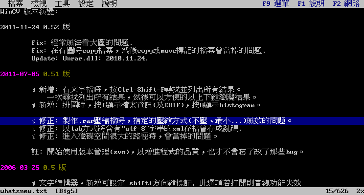

*讀文字檔時整列反白標出游標在哪一行，狀態列右邊跟著報 `15/626`。
原版的工具列一直在報游標在第幾行（「1 字 1 行/ 626」），只是沒有把那一列
畫出來 —— 長檔案捲到一半時，「我剛才看到哪裡」是靠一條線記住的。
ANSI 彩色簽名檔的底色本身有意義，蓋掉會失真，所以 `L` 關得掉。*

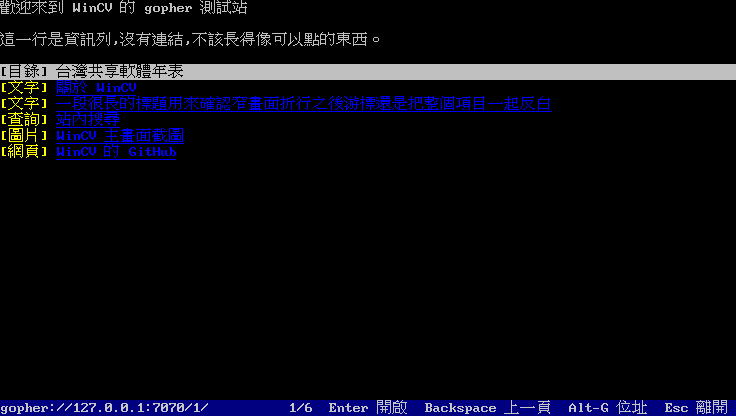

*gopher 選單。型別標籤在每一列前面，資訊列沒有標籤也沒有連結。*

選 gopher 而不是 HTTP 是因為協定的形狀：一行一個項目、型別寫在第一個位元組，
選單結構幾乎就是目錄列表——那正是這個畫面在做的事。HTTP 的難處全在 HTML，
而 HTML 要的排版、字體、腳本，這個畫面一樣都給不了。
文字內容**不重新斷行**（gopher 的東西多半是 70 欄排好的 ASCII），
編碼交給既有的判讀器（gopher 沒有 charset 欄位，中文站台那年代多是 Big5）。

markdown 裡的圖片只認**文件所在目錄底下**的相對路徑，而且不下載遠端圖片——
看一份文件不該變成連外行為，也不該讓一份來路不明的 `.md` 讀到別處的檔案。

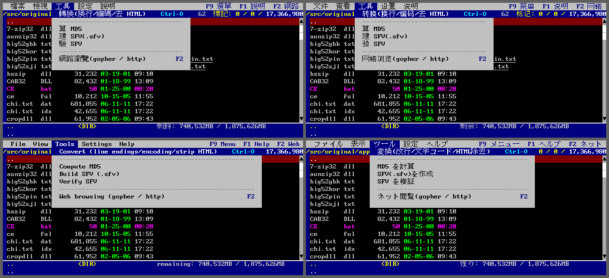

*同一個畫面的四種語言:繁體中文、简体中文、English、日本語。
選單、狀態列(剩餘／剩余／remaining／残り)與訊息都跟著換,
`F9` → 設定 → 語言 隨時可切,選過就記住。日文假名與簡體字倚天字庫裡
沒有,由後備字型畫 —— 那是 Big5 字庫的邊界,不是設定問題。*

## 操作

按鍵沿用原版（逐鍵實測的對照表在 [`docs/ui/keymap.md`](docs/ui/keymap.md)），
重製版另外補上滑鼠與幾個原版沒有的動作。

| 主畫面 | |
|---|---|
| `↑` `↓` `PgUp` `PgDn` `Home` `End` | 移動游標（**按住會自動重複**） |
| `Enter` | 進目錄／開檔；壓縮檔也是按 `Enter` 走進去 |
| `Space` | 標記；`C` 拷貝、`M` 移動、`R` 更名 |
| `Ctrl-→` / `Ctrl-←` | 主檔名欄加寬／縮窄一格 |
| `F1` `F2` `F9` | 使用說明／網路瀏覽／選單 |
| `Ctrl-+` `Ctrl--` ／ `Alt-+` `Alt--` | 字級／放大倍率 |
| `Alt-D` `Alt-P` | 磁碟窗格／預視窗格 |

| 滑鼠 | |
|---|---|
| 單擊清單 | 游標移過去 |
| 雙擊清單 | 等於 `Enter`：進目錄、開檔 |
| 單擊選單列 | 展開那個分類；再點一次收起；點內容區只收選單，不順便做那一下 |
| 橫向拖曳清單 | 拉寬／縮窄主檔名欄 |
| 滾輪 | 一格 = 3 次 `↑`／`↓`，各模式的意思照各自的按鍵 |
| 網頁上的連結 | 單擊就跟過去（瀏覽器的手感，不要求雙擊） |

按住方向鍵會自動重複這件事要自己做：Ebiten 只回報「剛按下」，
作業系統的鍵盤重複不會經過它——不做的話按住 `↓` 只會動一格，
而一個目錄可以有幾百個檔案。

## Office 文件與 PDF

原版沒有這些格式，所以沒有原版可以對照——對的是外部工具：Office 那一路讓
容器裡的 LibreOffice 把同一份檔案轉成純文字，PDF 的整頁算繪對的是 poppler。
下面幾張截圖用的示範文件在 [`docs/demo/office/`](docs/demo/office/)，
內容是本專案自己寫的；重建與重拍的指令在那個目錄的 README 裡。

五種 Office 格式收在同一個窄介面後面（`internal/officedoc`）。介面那一層
只認得「幾段內容 ＋ 幾張圖」，所以加第六種格式時它一行都不用改。

### Word

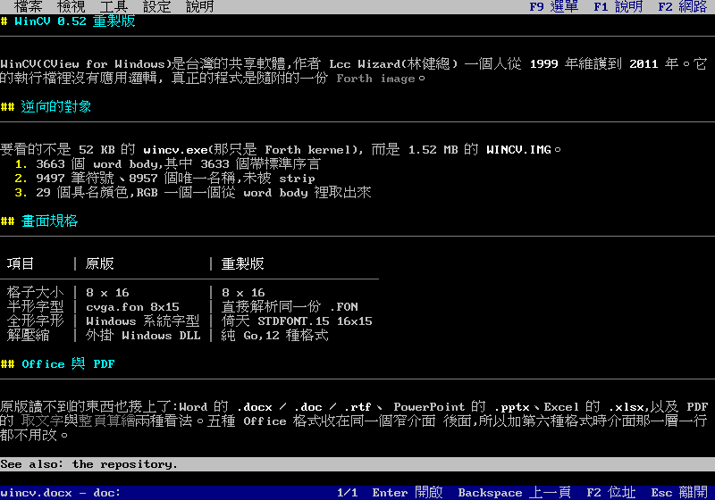

*`.docx` 開起來的樣子：標題、粗體、有序清單、表格都排進同一套字元格點。
`.doc`（Word 97–2003 的 FIB ＋ piece table）與 `.rtf` 走同一個畫面。*

### PowerPoint

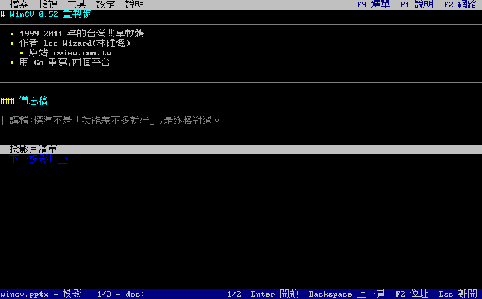

*`.pptx` 一張投影片一段，備忘稿跟著那一張收在後面。底下的「投影片清單 ／
下一張投影片」與 EPUB 的章節導覽是同一套。*

### Excel

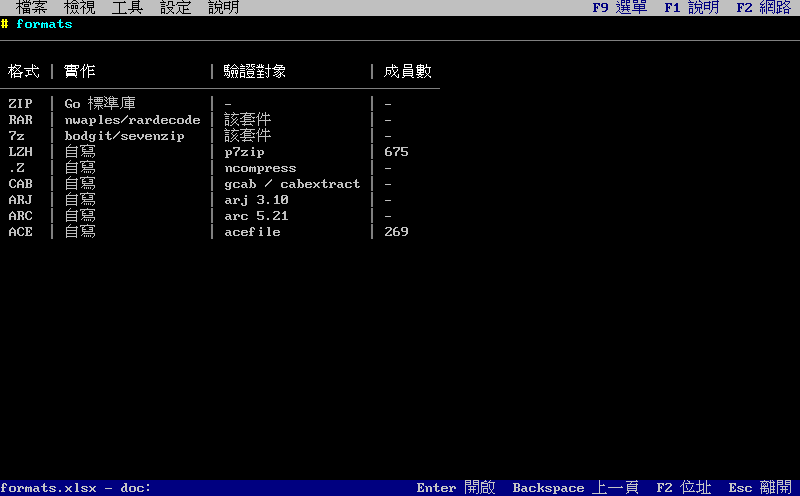

*`.xlsx` 的儲存格排成表格。共用字串表、數字格式與日期序列都在解析那一層
換算掉，畫面這一層只看到文字。*

### PDF：兩種看法

PDF 描述的是「把這個字放在這個座標」，沒有段落、沒有欄、沒有閱讀順序——
那些是排版的結果，不是資料。所以取文字那一路要自己把字組回列，再偵測分欄
（判準是「一條從頁首通到頁尾、沒有字跨過的縱向空白帶」，再用「每一欄大部分
的列有沒有填滿欄寬」把表格排除掉）。

| 取文字（`Enter`） | 整頁算繪（`V`） |
|---|---|
| 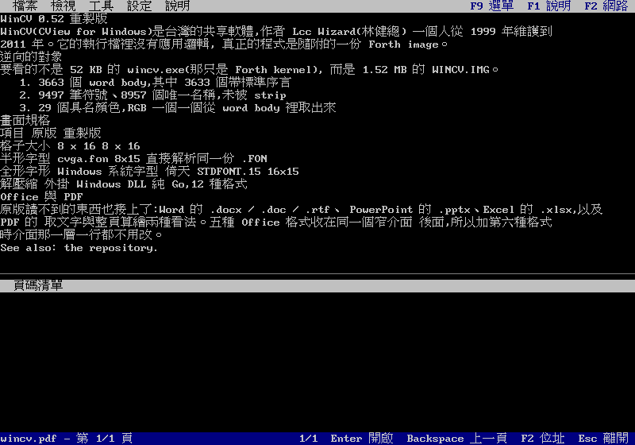 | 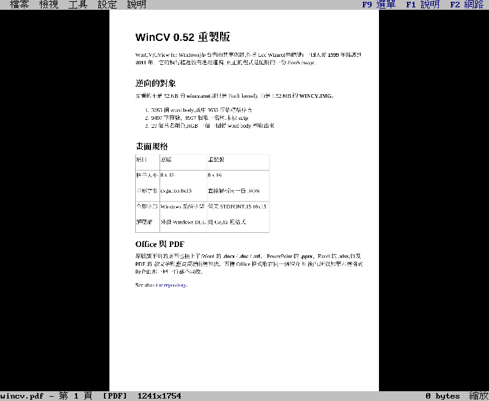 |

左邊找字快，右邊才看得到表格、圖表、公式、簽名那些「意義在位置上」的東西。

整頁那一路是自己寫的算繪器，沒有加新的相依——光柵器用 SVG 那條路本來就在用的
`rasterx`，字形外框用 `x/image/font/sfnt` 加自寫的 CFF 與 Type1 解譯器：

| | |
|---|---|
| 路徑 | 填色與描邊、線帽、接合、虛線；非零繞組與奇偶填法 |
| 色彩 | Gray / RGB / CMYK / ICCBased / Indexed / Separation |
| 影像 | 物件層交不出來的自己解：DCTDecode 直接當 JPEG，其餘走原始取樣值，影像自己的 `/SMask` 一起套 |
| 漸層 | 軸向與放射；指數、接合、取樣三種函式；漸層當填色圖樣 |
| 透明度 | 常數透明度、亮度與 alpha 兩種軟遮罩、透明群組 |
| 字型 | TrueType/OpenType、CFF、Type1 三種嵌入格式都解外框，含 `seac` 重音合成 |

驗收對照的是 poppler，另一個獨立的 PDF 算繪器：手寫的最小樣本
（漸層、透明度、重音合成、影像）墨水密度相關係數都在 0.9997 以上，
拿真實的論文、型錄、投影片量，六個頁面全部 ≥ 0.95。

要做哪些功能是量出來的，不是照規格的清單勾：`tools/pdfprobe scan` 掃 105 份
真實 PDF，拼貼圖樣、網格漸層、PostScript 計算函式**一次都沒出現**，
那三項就明講不做——看不懂的漸層留白，不塗一片猜的顏色。
量測方式與數字在 [`docs/plan/office-docs.md`](docs/plan/office-docs.md)。

## 署名

原作是 Lcc Wizard（林健總）的 WinCV 0.52，最後更新 2011-11-24。
這個 repo 是重製，署名的是重製這件事：

> Remake by 王俊又 —— 為保存台灣中文軟體盡一份心力

程式裡按 `F1` → 關於 可以看到同樣的內容。

### Android

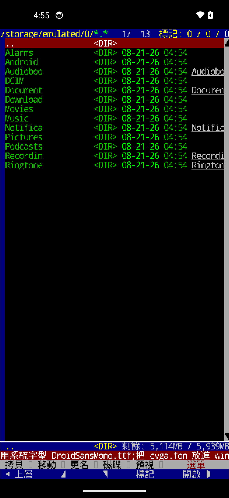

這張是 Android 14 模擬器（Pixel 5 profile，1080×2340）上的真實截圖。
畫面上看得到的：目錄列表、`剩餘: 5,114MB / 5,939MB` 的容量、
底部兩列觸控功能列，以及訊息列講「現在用的是系統字型 `DroidSansMono.ttf`」
——APK 裡不放原版的 `cvga.fon`（第三方版權物），使用者自己放進
`wincv/` 才會換成點陣像素對齊的版本。

`tools/build-android.sh` 建 APK（四個 ABI，minSdk 21），
`tools/run-android-emulator.sh` 把它裝進模擬器跑起來、截圖、收 logcat。
**還沒在實機上跑過，觸控輸入也還沒實測**——截圖證明畫得出來、讀得到檔案，
不證明點下去會動。

底部是三列：最上面一列的動作隨模式換（瀏覽時是標記／拷貝／移動／更名，
讀文件時是尋找／編碼／中英，看圖與 PDF 整頁時是上張／下張／縮小／放大／原寸），
底下兩列是固定的按鍵 HUD——

```
Esc  | PgUp | ▲ | PgDn | Enter
Home | ◀    | ▼ | ▶    | End
```

方向鍵排成十字，`Esc` 與 `Enter` 用不同顏色放在兩端。HUD 只放**真的按鍵**，
所以不會出現「這個模式下按了沒反應」的按鈕；模式相關的動作在上面那一列。

接上實體鍵盤（dock、藍牙）時按鍵與桌面版相同：鍵盤翻譯只有一份
（`internal/ebikeys`），Ebiten 在 Android 把 `KeyEvent` 送成同一套
`ebiten.Key`。這一條只驗過編譯，**還沒有真機接鍵盤的實測**。

搬上 Android 真正花時間的不是 `internal/` 底下那些套件（它們一行都沒改就編過了），
是三個藏在 Ebiten 的 Android 那層裡的行為：gomobile 的原生層要自己餵
`Context`、Activity 被重建一次就等於 app 結束、`Layout` 不能把收到的尺寸
原樣傳回去。三條的成因與症狀都寫在
[`docs/plan/android.md`](docs/plan/android.md)。

## 規劃中

- [Android 版評估與規劃](docs/plan/android.md)——第一版**只做唯讀瀏覽**。
  私人 sideload 走「所有檔案存取權」，`vfs.OS` 直接可用；
  SAF 是上架 Play 才需要的替代路徑。

## 文件

- `CLAUDE.md` — 目標軟體的已查證事實、逆向方法、架構、硬規則
- `CONTEXT.md` — 統一語言、已被推翻的斷言、決策紀錄
- `docs/ui/main-screen.md` — 原版主畫面的格點量測
- `docs/ui/keymap.md` — 按鍵表，證據分三級
- `docs/plan/office-docs.md` — Office 與 PDF 的解析、算繪與驗收數字
- `docs/formats/` — 資料檔格式規格
- `docs/re/` — 符號表、word 清單
