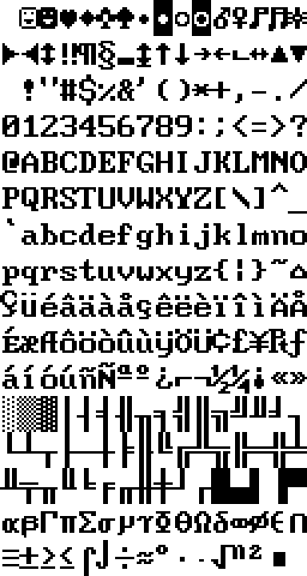
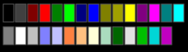

# WinCV Remake

把 1999–2011 年的台灣共享軟體 **WinCV 0.52（CView for Windows）** 逆向，
用 Go + Ebiten 重寫成 Linux / Windows / macOS 三個平台都能跑的版本。
原作者是 Lcc Wizard（林健總），原站 `cview.com.tw`。

這一頁是重製版自己畫出來的：底下的圖不是貼上去的，是 markdown 檢視模式
把 `` 解出來、光柵化、再嵌進字元格點裡。

## 半形字模來自原版的 .FON



`cvga.fon` 是 NE FNT 2.0、定寬 8×15、涵蓋 0x00–0xFF 的 **CP437**。
最上面那兩排（☺♥♦♣♠►◄↑↓▲▼）與 0xB0–0xDF 的 `░▒▓│─` 就是它是 CP437
而不是 Latin-1 的證據——把它當 Latin-1 用，`é` 會畫成 `Θ`。

## 29 個具名顏色取自 image 本體



名稱與順序在 `WINCV.IMG` 的 0x5692d，RGB 值在每個顏色 word 的 body
第 8–10 個位元組。上面那張是 SVG，用 oksvg 光柵化。

| 項目 | 原版 | 重製版 |
|---|:---:|---|
| 平台 | 32 位元 Windows | Linux / Windows / macOS |
| 壓縮格式 | 外掛 Windows DLL | 純 Go，12 種全部支援 |
| 圖檔 | FreeImage + Intel JPEG | 純 Go，12 種支援 11 種 |
| 全形字形 | 隨使用者的 Windows 而異 | 固定用倚天 16×15 |
| markdown | 沒有 | 排版 + 內嵌圖片 |

## 逐格比對過的版面

檔案清單那 16 列與原版的**屬性差是 0**，狀態列第二列連字模都完全相同。

- 指示欄是一整條 `#000080`，游標經過也不變
- 日期固定 `#00FF00`，游標列上也不變色
- 長檔名欄是 `#C0C0C0` 加底線，底線在格子的最後一條掃描線
- 游標列是白字配 `#800000`，不是反白

> 這些照終端機慣例猜，沒有一項會猜對。是把兩邊的截圖切成同一套格點、
> 逐格比對量出來的。

```go
// 折行要在片段之間與片段內部都能發生,而且樣式要跟著走。
// 中文不靠空白斷字 —— 只按空白折,一整段中文會變成一列超長的字。
func wrapSpans(spans []Span, cols int) [][]Span
```

---

Remake by 王俊又 —— 為保存台灣中文軟體盡一份心力
