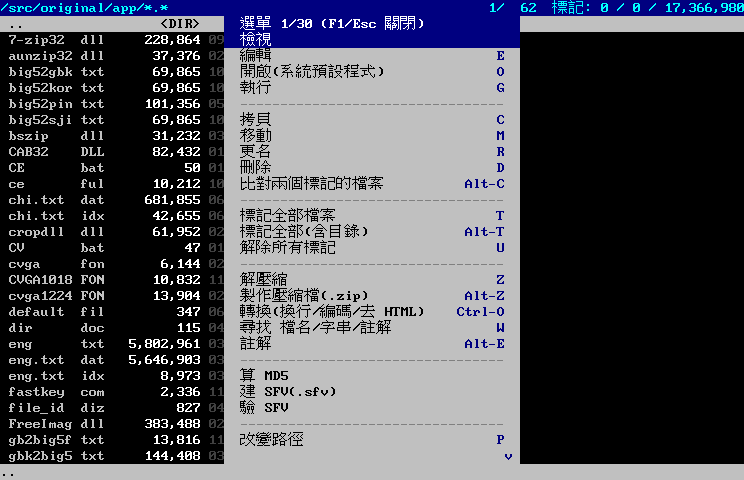

# 快捷鍵表

證據等級:

- **A** — 取自 `WINCV.IMG` 內程式自己的按鍵標籤字串(`docs/re/big5-strings.tsv`,附 offset)。
- **B** — 取自 `whatsnew.txt` / `WinCV.txt` 的敘述。說明檔會漏、會過期,但作者寫的功能敘述可信。
- **C** — 尚未找到出處,依同類軟體慣例推測。**實作前要在原版上實測**。

實測方式:`tools/oracle-shot.sh <out.png> <秒數> "<xdotool 按鍵序列>"`。

---

## 主畫面(檔案瀏覽器)

| 按鍵 | 動作 | 等級 | 出處 |
|---|---|---|---|
| `↑` `↓` | 移動游標 | C | |
| `PgUp` / `PgDn` | 上一頁 / 下一頁 | A | `0x7a22f` ` 上一頁`、`0x7a4b0` ` 下一頁` |
| `Home` / `End` | 第一筆 / 最後一筆 | C | |
| `Enter` | 進入目錄 / 看檔 | B | 「enter看檔時自動將可能為執行檔的…」 |
| `BackSpace` | 上一層目錄 | A | `0x775af` ` 上一層目錄` |
| `Space` | 標記,游標往下一格 | A | `0x79954` `Space 標記` |
| `T` | 標記所有檔案(不含目錄) | A | `0x79bd5` `T 標記所有檔案(不含目錄)` |
| `Alt-T` | 標記所有檔案**及目錄** | B | 0.5 版:「`Alt-T` 改為標記所有檔案及目錄(`T` 為只標記所有檔案)」 |
| `U` | 解除所有標記 | A | `0x79e56` `U 解除所有標記` |
| `C` | 拷貝 | A | `0x77988` `C 拷貝` |
| `M` | 移動 | A | `0x77c09` `M 移動` |
| `R` | 改名 | A | `0x77e8a` `R 改名` |
| `D` | 刪除 | A | `0x78263` `D 刪除` |
| `Del` | 徹底刪除(先填 0 再刪) | B | 0.5 版新增選項 |
| `E` | 編輯 | A | `0x7863c` `E 編輯` |
| `Alt-E` | 註解 | A | `0x788bd` `Alt-E ; 註解` |
| `G` | 執行 | A | `0x78b3e` `G 執行` |
| `Z` | 解壓縮 | A | `0x78f17` `Z 解壓縮` |
| `Alt-Z` | 製作(加入)壓縮檔 | A | `0x79198` `Alt-Z 製作(加入)壓縮檔` |
| `W` | 尋找 檔名/字串/註解 | A | `0x7957b` `Where 尋找 檔名/字串/註解` |
| `Alt-C` | 比較標記的兩個檔案(binary) | B | 0.5 版新增 |
| `O` | 開啟編輯檔案(可用別名) | B | 0.5 版:「開啟編輯檔案(`O`)、改變目徑(`P`)」 |
| `P` | 改變路徑(可用別名) | B | 同上 |
| `5` | 改變檔案列表的方式 | B | 「`5` 改變檔案列表的方式(同 CView)」 |
| `F1` | 選單 | A | `0xcaa22` `選單(F1)` |

> **重製版把 `F1` 改成使用說明,選單移到 `F9`。** 這是刻意偏離原版:
> 重製版的選單常駐在畫面最上方那一列,不再需要一顆鍵去叫它出來,
> 而 `F1` 在 `F1`=說明 已成通例的今天空著比綁選單有用。
| `F8` | 切換 中英文顯示 | A | `0x84998` `F8 切換 中英文顯示` |
| `F11` | 全螢幕 / 恢復 | A | `0x7a889` `F11 全螢幕／恢復` |
| `Alt-P` | 切換是否開啟預視視窗 | B | changelog |
| `Ctrl-O` | 轉換(換行、編碼、去 HTML、批次改名) | B | `file_id.diz` 第 9/10/11 條 |
| `Alt-↑` | 回復縮到右下角的視窗(第二份用 `Alt-↓`) | B | 0.5 版新增 |
| `Ctrl-Alt-S` | 視窗抓圖 | A | `0x103389` `視窗抓圖(按Ctrl-Alt-S)` |
| `Enter`(執行檔上) | 自動以 16 進位檢視 | B | 0.5 版:「按 enter 看檔時自動將可能為執行檔的檔案以 16 進位方式看檔」 |

remake 的實作狀態(打勾表示已接上,空白表示鍵有定義但功能還沒做):

| 已實作 | 按鍵 |
|---|---|
| ✅ | `↑↓` `PgUp/PgDn` `Home/End` `Enter` `BackSpace` `Space` `T` `Alt-T` `U` |
| ✅ | `C` 拷貝、`M` 移動、`R` 改名、`D` 刪除、`Del` 徹底刪除、`Alt-C` 比對 |
| ✅ | `E` 編輯、`5` 縮圖列表、`S` 換排序 |
| ✅ | `G` 執行、`Z` 解壓縮、`Alt-Z` 製作壓縮檔、`W` 尋找、`Alt-E` 註解 |
| ✅ | `O` 開啟、`P` 改路徑、`F9` 選單、`F8` 中英文、`F11` 全螢幕、`Ctrl-O` 轉換 |
| ✅ | `F1` 使用說明(重製版自己的,見上方說明) |
| ✅ | `Alt-P` 預視窗格(底部 8 列,顯示游標所在檔案的開頭) |

`cmd/celldump -touch` 會多畫一條觸控功能列(Android 版的介面草案,
見 `docs/plan/android.md`)。桌面版的視窗不開這條列。

markdown 檢視模式(開 `.md` / `.markdown` 自動進入):

| 按鍵 | 動作 |
|---|---|
| `↑` `↓` `PgUp` `PgDn` `Home` `End` | 捲動 |
| `Enter` | 把畫面上第一張圖用看圖模式放大;`Esc` 退回文件 |
| `Esc` | 回檔案清單 |

要看 markdown 原始碼按 `E` 進編輯器(有語法上色)。

重製版自己加的鍵(原版沒有對應):

| 按鍵 | 動作 | 說明 |
|---|---|---|
| `Alt-+` / `Alt--` / `Alt-0` | 放大倍率 ±0.1 / 回到 1.0 | 見下方「放大倍率與字級」 |
| `F9` | 選單 | 原版是 `F1`。選單列常駐在最上方那一列,`F9` 只是展開下拉 |
| `F1` | 使用說明 | 內嵌的 markdown,用 markdown 檢視模式顯示 |
| `F2` | 網路瀏覽 | 見下方「網路瀏覽」一節 |
| `Alt-X` | 離開 | 原版沒有離開鍵(Win32 程式關視窗就是離開)。重製版需要一條「程式自己知道要收尾」的路徑,最後的位置就是在那裡記下的。編輯中還有沒存的東西會先問一句 |
| `Alt-D` | 開關左側磁碟窗格 | 原版的磁碟視窗在 Win32 工具列那一帶,開關在設定對話框(「檔案列表要列出磁碟機?」);重製版沒有那個對話框,改綁一個鍵 |
| `Tab` | 焦點在清單與磁碟窗格之間切 | 窗格關著時無作用 |
| `Ctrl-+` / `Ctrl-=` | 放大字體 | 在原版隨附的三種點陣字型之間換(8×15 → 10×18 → 12×24) |
| `Ctrl--` | 縮小字體 | |
| `Ctrl-0` | 回到最小字級 | |

### 滑鼠

原版是 Win32 程式,滑鼠本來就能用;重製版做同一套,不是新功能。
所有平台共用 `app.Click` / `Wheel` / `MenuBarClick` / `MenuDropClick`,
它們只認**格子座標**;像素怎麼換成格子(內容層與選單層的倍率不同、
選單列佔幾個像素、下拉貼在哪)是外殼的事(`cmd/wincv/input.go` 的 `hitTest`)。

| 動作 | 效果 |
|---|---|
| 單擊清單 | 游標移過去(磁碟窗格也一樣,順便把焦點切過去) |
| 雙擊清單 | 等於 `Enter`:進目錄、開檔 |
| 單擊網頁的連結 | 直接跟過去(瀏覽器的手感,不要求雙擊) |
| 單擊縮圖 / 雙擊縮圖 | 選 / 開 |
| 單擊編輯器 | 游標放到那個字(全形字點後半格也算) |
| 單擊選單列 | 展開那個分類;再點一次收起;點空白處收起 |
| 單擊下拉項目 | 執行;分隔線不動 |
| 下拉開著時點內容區 | 只收選單,**不**順便做那一下 |
| 滾輪 | 一格 = 3 次 ↑/↓,各模式的意思照各自的按鍵 |

雙擊的判定:同一格、400 ms 內的第二下。第二下之後歸零,第三下不算再一次雙擊。

**按住方向鍵會自動重複**(0.4 秒後開始,每 0.05 秒一次):Ebiten 只回報
「剛按下」,作業系統的鍵盤重複不會經過它,所以要自己做。只對 ↑↓←→ /
PgUp / PgDn / Backspace / Delete 做;F 鍵與 Enter 重複會連開好幾層。

實測方式(主機上跑 `xvfb-run` + `xdotool`):`xdotool click` 按著只有
約 12 ms,短於一個 tick(16 ms),**會被漏掉**;要用 `mousedown` / `sleep 0.06` /
`mouseup`。點清單第 4 列 → `4/62`;按住 ↓ 一秒 → `17/62`;點「檢視」→
下拉展開;點第 2 項 → 清單重排;雙擊 `..` → 回到上一層;滾輪兩格 → 往下 6 列。

### 放大倍率與字級

`Alt-+` / `Alt--` 每次 0.1,範圍 1.0–4.0。

點陣字非整數倍放大**必然**不勻:8 px 寬放大 1.2 倍是 9.6 px,取整之後
某些像素列被複製兩次、某些一次,同一個字的直筆會有的 1 px 有的 2 px。

所以倍率不是直接把字模拉大,而是**先挑一個原生的點陣字級**。原版隨附
三種(8×15 / 10×18 / 12×24),它們之間的比例正好是 1.19 與 1.56 ——
「放大 1.2 倍」可以用原生的 10×18 字模達成,每一個像素都是當年設計
出來的。挑法在 `cmd/wincv` 的 `pickLevel`:往大的字級找,取「剩下的
倍率最接近整數」的那一級;差 5% 以內就當剛好(1.02 倍與 1.00 倍的
尺寸差不到一個像素,而前者會讓某一列變成雙倍粗)。

| 倍率 | 用哪一份字模 | 再放大 |
|---|---|---|
| 1.0 | 8×15 | ×1 |
| 1.1 | 8×15 | ×1.10 |
| **1.2** | **10×18** | **×1** |
| 1.3 | 10×18 | ×1.10 |
| 1.4 | 10×18 | ×1.18 |
| **1.5** | **12×24** | **×1** |
| **1.6** | **12×24** | **×1** |
| 1.7 | 12×24 | ×1.09 |
| 1.8 | 12×24 | ×1.15 |
| 1.9 | 8×15 | ×1.90 |
| **2.0** | **8×15** | **×2** |

「再放大 ×1」的那幾格每個像素都是字模原本的樣子,完全均勻。其餘仍然
會有粗細不勻,但殘餘的倍率比直接放大小得多 —— 1.4 倍是把 10×18 拉大
1.18 倍,不是把 8×15 拉大 1.4 倍。2.0 以上另外還有幾個均勻點:
2.4(10×18 ×2)、3.0、3.1–3.2(12×24 ×2)、3.6(10×18 ×3)、4.0。

1.9 是個例外:它離 ×2 只差 0.1,演算法判斷直接放大 8×15 比換字級划算。

驗證方式:`-no-resume -cols 74 -rows 22 -scale <值>` 跑起來量視窗的
像素大小回推格子。1.0 / 1.2 / 1.5 / 1.6 / 2.0 五個點量到的格子分別是
8×16、10×19、12×25、12×25、16×32(格高含 1 px 列距),與上表相符。
**量測要加 `-no-resume`** —— 不加的話會還原上一次的倍率,而畫面看起來
完全正常,只是量到的是別的值。

**全形中文的改善有限。** 倚天只有 15 點那一份字庫(24 點的在光碟上是
ETUNPACK 壓縮的,還解不開),其餘字級的漢字都是由 16×15 縮放來的,
換字級改變不了這件事。改善的是英數字 —— 而檔名、大小、日期那幾欄
都是英數字。

### 選單與內容的字型分離

選單那一層有自己的格點,由外殼**分開光柵化再依像素座標疊上去** ——
所以它可以用與內容完全不同的字型與大小。

- `F9` → 設定 → 選單字級:在載到的點陣字級之間選,或「跟著內容」。
- 啟動時 `-menu-font <TTF/TTC/OTF> -menu-size <像素> -menu-scale <倍率>`:
  選單改用一份向量字型現場產字模。

為什麼要分:內容要的是「與原版逐像素對齊的點陣字」,那是這個 remake
存在的理由之一;選單只是介面,在高解析度螢幕上用一份大一點、清楚一點的
字反而好認。硬綁在一起就得二選一。

代價是選單列吃掉的是**像素**而不是格:視窗的可用高度要先扣掉選單列的
像素高,剩下的才換算成內容的列數。

### 電子書(EPUB)

游標停在 `.epub` 上按 `Enter` 先看到目錄,點章節進去讀,章末有「上一節 /
目錄 / 下一節」。走的是與 gopher、網頁同一個瀏覽畫面 —— 一本書就是
「一份目錄加上一堆用連結串起來的章節」,和 gopher 選單是同一個形狀,
連結導覽、上一頁、內嵌圖片全部共用。

**`.epub` 要在壓縮檔判斷之前攔下來。** EPUB 就是一個 zip,不先攔的話
按 Enter 會走進去看到 `META-INF` 與一堆 xhtml,而那不是任何人想看一本書
時要的東西。

### PDF

游標停在 `.pdf` 上按 `Enter` 直接開第一頁(不從頁碼清單開始 —— 一份
文件的「目錄」只是一排頁碼,而使用者要的就是第一頁),頁末有
「上一頁 / 頁碼清單 / 下一頁」。

取出的是**文字與圖片,不是版面**。PDF 描述的是「把這個字放在這個座標」,
沒有段落、沒有欄、沒有閱讀順序 —— 那些是排版的結果而不是資料。
要在字元格點上重現原始版面等於要寫一個 PDF 渲染器,純 Go 沒有堪用的,
接 C 函式庫又會破掉四平台交叉編譯。

三個已知限制:

- **分欄的文件會左右欄交錯。** 同一條掃描線上的字被接成一列,而分欄
  版面的同一條線上有兩欄的內容。
- **沒有嵌入字型的 PDF 還原不出詞間空白。** 那種檔案裡每個字元的座標
  都相同(前進量要查字型的寬度表,而標準 14 字型沒有嵌在檔案裡),
  空格字元本身又不會出現在文字串流中 —— 線索兩邊都沒有。真實世界的
  PDF 幾乎都嵌入字型,不受影響。
- **圖片放在每一頁的末尾。** PDF 沒有交代圖畫在哪一段旁邊(那是 content
  stream 裡的座標變換,而抽圖的那一層只交出點陣資料),硬猜位置會讓
  圖片插在錯誤的段落之間,比放在頁末更難讀。

`rsc.io/pdf` 遇到看不懂的東西是 **panic 而不是回錯誤**(例如 DCTDecode
這個到處都是的濾鏡),所以每一個入口都用 recover 包住。這是檔案管理器,
使用者會開到各種來路不明的 PDF。

### 記住上次的位置

關掉時會把「人在哪裡」寫進 `~/.config/wincv/session.json`(取不到就退回
`~/.wincv-session.json`),下次開起來回到同一個目錄、同一個游標位置、
同一份文件與捲動位置,連字級、放大倍率與視窗格數都一起帶回去。

不是只在關閉時寫:換目錄或開關檔案的當下就寫一次。只在關閉時寫的話,
程式被 kill、系統關機、當掉這三種情況等於沒寫,而那正是使用者最不希望
失去位置的時候。捲動不觸發寫檔(只比對「人在哪裡」那幾個欄位),
捲動位置在關閉時順帶寫入。

不存的東西同樣是刻意的:標記、剪貼、搜尋結果、瀏覽歷史都不存 ——
那些是「這一次」的工作,下次開起來還在反而礙事。壓縮檔內部的位置
也不存,改成退到壓縮檔本身所在的目錄並讓游標停在它上面
(那條路徑下次啟動走不到)。

命令列指定了目錄就以命令列為準。`-no-resume` 整個關掉這個行為。

視窗放大時內容會變多(格子大小固定,多出來的空間就是多幾格),
要把內容放大是換字級或啟動時加 `-scale`。

畫面最上方那一列是選單列,分成**檔案 / 檢視 / 工具 / 設定 / 說明**五類,
`F9` 展開下拉、`←` `→` 換分類、`↑` `↓` 選項目、`Enter` 執行、`Esc` 關閉。
下拉同時是說明書:每一列右邊列出對應的按鍵,在下拉裡直接按那顆鍵等同選它。
MD5 與 SFV 原版沒有查到對應的按鍵,只掛在選單上。

選單列會吃掉一格列 —— 原版那條是 Win32 的原生選單,掛在 client area 之外,
不佔任何字元格。所以「原版版面」這個視窗檔位是 **93×22** 而不是 93×21,
多的一列給選單列,內容區才是原版的 21 列。

## 看圖

| 按鍵 | 動作 | 等級 | 出處 |
|---|---|---|---|
| `Enter` | 看下一張 | A | `0xd535e` 附近 / changelog |
| `BackSpace` | 看上一張圖 | A | `0xd535e` `BackSpace 看上一張圖` |
| `Space` | 標記此檔,換看下一張 | A | `0xd587b` `Space 標記此檔，換看下一張圖` |
| `;` / `Alt-E` | 註解 | A | `0xd6908` `; 或 Alt-E 註解` |
| `Ctrl-S` | 連續播放(Slide Show) | A | `0xd70c6` `Ctrl-S ; 連續播放` |
| `Alt-S` | 存檔(直接覆蓋原圖) | B | changelog |
| `I` | 顯示檔案資訊與 EXIF | B | 0.51 版新增 |
| `H` | 顯示 histogram | B | 0.51 版新增 |
| `Esc` | 離開看圖 | B | 「`ENTER` 離開看圖」為選項之一 |

## 文字檢視

| 按鍵 | 動作 | 等級 | 出處 |
|---|---|---|---|
| `BackSpace` | 看上一個文件檔 | A | `0x8679e` `BackSpace 看上一個文件檔` |
| `F8` | 切換 中英文顯示 | A | `0x84998` |
| `W` | 切換 自動換行 | A | `0x849e1` `&W)rap 切換 自動換行` |
| `Alt-M` | 切換行距 0 ↔ 3 | A | `0x84a2c` `Alt-M 切換行距 0 <-> 3` |
| `F11` | 切換全螢幕 | A | `0x84aff` |
| `A` | ANSI 彩色文字顯示切換 | A | `0x84b64` `ANSI彩色文字顯示(&A切換)` |
| `Ctrl-F` | 尋找 | A | `0x9d9f3` `Ctrl-F 尋找` |
| `Ctrl-Shift-F` | 尋找並列出所有結果 | B | 0.51 版新增 |
| `Ctrl-N` | 續找 | A | `0xe7e97` `Ctrl-N 續找` |
| `H` | 切換 16 進位檢視 | A | `0x10e01d` `&Hex模式`(`&H` 就是快捷字母) |
| `F7` | 字典視窗(編輯器內) | C | 原版是設定項「顯示字典視窗?」,沒有對應快捷鍵,這是 remake 自己定的 |

## 16 進位檢視

| 按鍵 | 動作 | 等級 | 出處 |
|---|---|---|---|
| `H` | 切回文字檢視 | A | 同上,`&Hex模式` 是切換 |
| `Esc` | 回檔案列表 | C | |
| `↑↓` `PgUp` `PgDn` `Home` `End` | 捲動 | C | |

## 文字編輯器

| 按鍵 | 動作 | 等級 | 出處 |
|---|---|---|---|
| `F6` | 尋找/取代 | A | `0xe7c16` `F6 尋找/取代` |
| `Ctrl-N` | 續找 | A | `0xe7e97` |
| `Ctrl-E` | 標記轉註解(整行加/去註解記號) | A | `0x8838c` |
| `Alt-B` | 標記區塊 | A | `0xe8275` `Alt-B 標記區塊` |
| `Alt-L` | 標記(整列) | A | `0xf55d5` `請先標記區塊(alt-B, Alt-L)` |
| `Alt-U` | 取消區塊 | A | `0xe84fc` `Alt-U 取消區塊` |
| `Alt-Z` | 拷貝區塊(插入) | A | `0xe88db` `Alt-Z 拷貝區塊(插入)` |
| `Alt-M` | 移動區塊(插入) | A | `0xe8b62` `Alt-M 移動區塊(插入)` |
| `Alt-F` | 填充區塊 | A | `0xe8de9` `Alt-F 填充區塊` |
| `Alt-D` | 刪除區塊 | A | `0xe9070` `Alt-D 刪除區塊` |
| `Ctrl-C` | 複製到剪貼薄 | A | `0xe944f` `Ctrl-C 複製到剪貼薄` |
| `Ctrl-X` | 剪到剪貼薄 | A | `0xe96d5` `Ctrl-X 剪到剪貼薄` |
| `Ctrl-V` | 貼上剪貼薄 | A | `0xe9ab3` `Ctrl-V 貼上剪貼薄` |
| `Ctrl-A` | 標記全檔(可設定) | B | changelog:「`Ctrl-A` 是否為標記全檔的功能」 |
| `Ctrl-U` | 恢復(undo) | B | changelog:「`Ctrl-U` 恢復用 `ctrl-y` 或刪除區塊」 |
| `Ctrl-F8` | 切成英文顯示 | B | changelog:「`F8`(編輯器按 `Ctrl-F8`)」 |
| `F11` | 全螢幕 | A | `0xe9e91` |

編輯器已接上:`F6` 尋找/取代(兩段式問:先問找什麼、再問換成什麼;
留空就是只尋找)、`Ctrl-N` 續找、`Ctrl-E` / `Alt-E` 註解、區塊操作、`Ctrl-U` 恢復、
`Ctrl-S` 存檔、`F7` 字典。註解記號取自 `keyword_*.cfg` 的設定,
**沒有設定就不動手** —— 猜一個 `//` 上去,在 `.ini` 或 `.asm` 裡是錯的。

看圖模式的 `;` / `Alt-E` 是**檔案註解**(寫進 `dir.doc`),不是程式碼註解;
這兩者的出處是不同段落的字串,不要混。

## 網路瀏覽(原版沒有)

原版沒有這個功能,所以下表沒有證據等級 —— 它不是重現,是新加的。
做 gopher 而不是 HTTP 的理由:gopher 的協定形狀就是「一行一個項目、
型別寫在第一個位元組」,與這個畫面天生相合;HTTP 的難處全在 HTML,
而 HTML 要的排版、字體、腳本這個畫面一樣都給不了。

| 按鍵 | 動作 |
|---|---|
| `Alt-G` | 輸入位址。在檔案清單按也可以,那是進入這個模式的入口 |
| `↑` `↓` | 移動連結游標。沒有連結的頁面(文字檔)則是捲動 |
| `Tab` | 下一個連結 |
| `PgUp` `PgDn` `Home` `End` | 捲動 |
| `Enter` | 開啟游標所在的連結 |
| `Backspace` | 上一頁 |
| `Esc` | 離開,回檔案清單 |

項目型別會標在每一列前面:`[目錄]` `[文字]` `[圖片]` `[查詢]` `[網頁]`。
資訊列沒有標籤也沒有連結 —— 它就是一行說明,不該長得像可以點的東西。

`[查詢]`(型別 7)按 `Enter` 會先問查詢字串。
`[網頁]`(型別 h)指向 http(s),這個客戶端不解 HTTP,只把位址顯示出來。

三件與畫面有關的事:

- 文字檔用「保留原樣」的方式排,**不重新斷行**。gopher 的內容多半是
  70 欄排好的說明或 ASCII art,重排會弄壞它。
- 編碼交給 `internal/textenc` 判讀。gopher 沒有 charset 欄位,
  而中文站台那個年代多半是 Big5。
- 取回是非同步的。外殼靠 `app.Busy()` 決定要不要繼續重繪 ——
  不看它的話結果回來了畫面也不會動,使用者看到的是永遠停在「連線中」。

## 用 celldump 檢查畫面

`cmd/celldump` 的 `-app` 模式跑的是和 `cmd/wincv` 同一份 app 程式碼,只是
不開視窗,所以選單、輸入列、搜尋結果這些自繪的東西可以在沒有顯示器的
地方檢查:

```
tools/go.sh run ./cmd/celldump -app /src/testdata -keys "F9" -o shot.png
tools/go.sh run ./cmd/celldump -app /src/testdata -keys "W,S,t,x,t,Enter" -o find.png
```

`-keys` 的寫法和本文件的按鍵欄一致(`Ctrl-O`、`Alt-Z`、`F6`、`Down`…),
短寫 `C-o` / `A-z` 也吃。



## 尚待實測的項目

1. `↑↓` `Home` `End` 的實際行為(等級 C)。
2. 主畫面 `Enter` 在壓縮檔上是「進入」還是「解壓縮」。
3. `Esc` 的語意 —— 原版是回上一層還是離開程式。這關係到
   `~/.claude/knowledge-base/retro-cht/esc-cancel-f10-quit-autosave/SKILL.md` 的處理原則。
   目前 remake 一律當「回上一層」,永遠不會直接結束程式。
4. `5` 的「改變檔案列表的方式」實際有幾種模式。remake 目前把它當成
   「切到縮圖列表」——縮圖確實是一種列表方式,但原版可能還有別的模式。
5. 編輯器的存檔鍵。image 裡只找到檢視模式的 `A 另存新檔` 與
   `S 將標記區存檔`,編輯器本身沒找到。remake 用 `Ctrl-S`。
6. 拷貝/移動的目的地怎麼指定。原版是對話框,remake 用底部輸入列。
